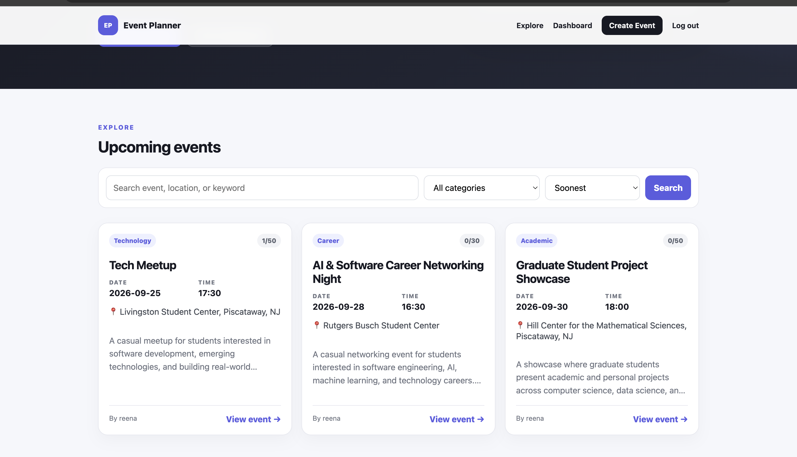
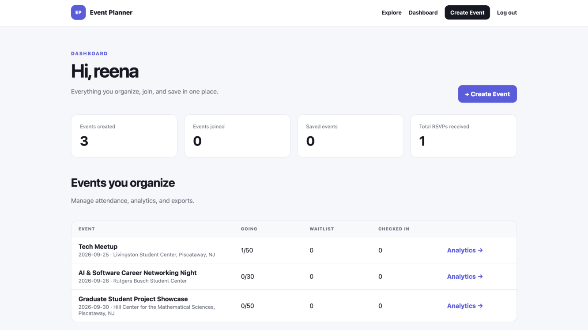
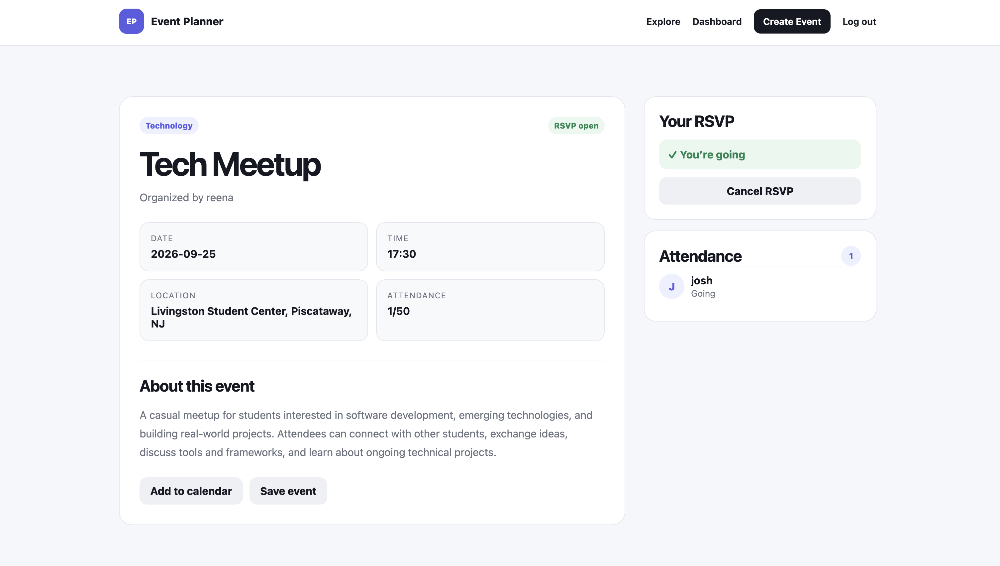
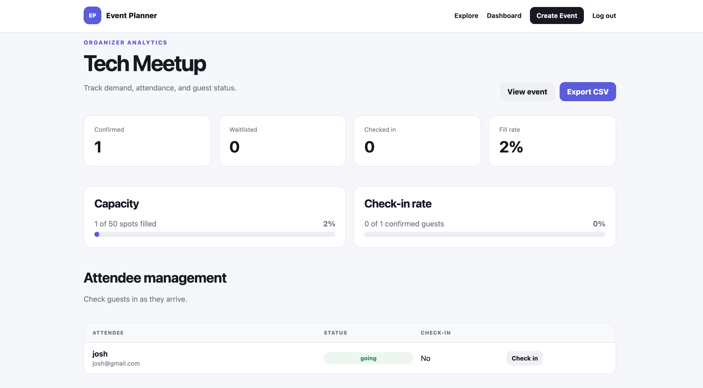

# Event Planner

Event Planner is a full-stack Flask web application for discovering, creating, managing, and attending events.

The application supports both attendees and organizers, including RSVP management, automatic waitlists, attendance tracking, analytics, event saving, CSV exports, calendar downloads, automated testing, and continuous integration.

I built this project to strengthen my full-stack development skills while focusing on application architecture, database design, user workflows, testing, and deployment.

---

## Features

### Attendees

- Create an account and securely log in
- Browse upcoming events
- Search events by title, description, or location
- Filter events by category
- Sort events by soonest, newest, or popularity
- View detailed event information
- RSVP to available events
- Automatically join a waitlist when an event reaches capacity
- Automatically move from the waitlist when a confirmed attendee cancels
- Cancel an RSVP
- Save and unsave events
- Download events as `.ics` calendar files
- View joined events from the personal dashboard
- View saved events from the personal dashboard
- See whether an RSVP is confirmed or waitlisted

### Organizers

- Create events
- Edit event information
- Duplicate existing events
- Delete events
- Cancel events
- Add event cover images using image URLs
- Define event categories
- Set event date and time
- Add location and description
- Define maximum event capacity
- Track confirmed attendees
- Track waitlisted attendees
- Monitor event capacity
- View attendance analytics
- View event fill rate
- Track attendee check-ins
- View check-in rate
- Check attendees in and out
- Export attendee information as CSV
- View attendee names, emails, RSVP status, and check-in status

---

## Screenshots

### Explore Events



### Organizer Dashboard



### Attendee RSVP Experience



### Event Analytics



---

## Automatic Waitlist Management

One of the main application workflows is automatic waitlist promotion.

When an event reaches maximum capacity:

1. Additional users are automatically placed on the waitlist.
2. Waitlisted users are stored in RSVP order.
3. If a confirmed attendee cancels, the earliest waitlisted attendee is automatically promoted.
4. Event statistics immediately reflect the updated attendance.

This logic is handled in the application service layer.

---

## Organizer Analytics

Each organizer has access to an analytics page for their events.

Analytics include:

- Confirmed attendee count
- Waitlist count
- Checked-in attendee count
- Event capacity
- Fill percentage
- Check-in percentage
- Individual attendee status
- Attendance management
- CSV attendee export

---

## Dashboard

The user dashboard combines three major areas.

### Events You Organize

Organizers can quickly view:

- Event status
- Confirmed attendance
- Waitlist size
- Check-in count
- Capacity progress
- Analytics
- Event editing tools

### Your RSVPs

Attendees can see events they joined and whether their RSVP status is:

- Going
- Waitlist

### Saved Events

Users can bookmark events and access them later from the dashboard.

---

## Tech Stack

### Backend

- Python
- Flask
- SQLite
- Werkzeug

### Frontend

- HTML5
- CSS3
- Jinja2

### Testing

- Pytest
- Flask test client
- Temporary SQLite test databases

### DevOps

- Git
- GitHub
- GitHub Actions
- Gunicorn
- Render

---

## Application Architecture

The project was refactored from a single Flask application file into a more modular structure.

```text
event_planner/
│
├── app.py
├── config.py
├── db.py
├── helpers.py
├── services.py
├── requirements.txt
├── render.yaml
│
├── static/
│   └── style.css
│
├── templates/
│   ├── analytics.html
│   ├── base.html
│   ├── dashboard.html
│   ├── error.html
│   ├── event_detail.html
│   ├── event_form.html
│   ├── home.html
│   ├── login.html
│   └── register.html
│
├── tests/
│   └── test_app.py
│
└── .github/
    └── workflows/
        └── tests.yml
```

---

## Architecture Overview

### `app.py`

Contains:

- Flask application setup
- Route definitions
- Authentication workflows
- Event workflows
- RSVP endpoints
- Favorites
- Analytics routes
- CSV export
- Calendar export
- Error handling

### `config.py`

Stores application configuration such as:

- Secret key
- Database path
- Testing configuration

### `db.py`

Handles:

- SQLite connections
- Table creation
- Database initialization
- Schema migrations

### `helpers.py`

Contains reusable utility functions such as:

- ISO timestamp generation
- Event date validation
- Percentage calculations

### `services.py`

Contains reusable application and business logic such as:

- Event statistics
- Waitlist promotion
- Dashboard event retrieval

This separation keeps routing, database logic, utilities, and business logic easier to maintain.

---

## Database Design

The application uses four primary tables.

### Users

Stores:

- User ID
- Name
- Email
- Password hash
- Account creation time

### Events

Stores:

- Organizer
- Event title
- Category
- Date
- Time
- Location
- Description
- Capacity
- Cover image
- Event status
- Featured status
- Creation time

### RSVPs

Stores:

- Event
- User
- RSVP status
- Check-in status
- RSVP creation time

RSVP status can be:

```text
going
waitlist
```

### Favorites

Stores events saved by individual users.

---

## Automated Testing

The project includes an automated Pytest test suite covering major application workflows.

Current test coverage includes:

- Homepage loading
- Registration
- Duplicate registration
- Password validation
- Login
- Invalid login attempts
- Authentication protection
- Event creation
- Event persistence
- Event discovery
- RSVP creation
- Duplicate RSVP prevention
- Organizer RSVP prevention
- Capacity handling
- Waitlist creation
- Waitlist promotion
- RSVP cancellation
- Cancelled event handling
- Favorites
- Analytics permissions
- Event editing
- Event ownership permissions
- Event duplication
- Event deletion
- Attendee check-in
- CSV export
- Calendar export
- Dashboard RSVP status
- 404 handling

Run the test suite with:

```bash
pytest -q
```

---

## Continuous Integration

GitHub Actions automatically runs the test suite whenever code is pushed or a pull request is created.

Workflow file:

```text
.github/workflows/tests.yml
```

The workflow:

1. Checks out the repository
2. Configures Python
3. Installs dependencies
4. Runs the Pytest suite

This helps prevent new changes from breaking existing functionality.

---

## Run Locally

### 1. Clone the repository

```bash
git clone https://github.com/HaripriyaReddyPatil/event-planner.git
```

Move into the project:

```bash
cd event-planner
```

### 2. Create a virtual environment

```bash
python3 -m venv venv
```

Activate it on macOS or Linux:

```bash
source venv/bin/activate
```

On Windows:

```bash
venv\Scripts\activate
```

### 3. Install dependencies

```bash
pip install -r requirements.txt
```

### 4. Run the application

```bash
python app.py
```

Open:

```text
http://127.0.0.1:5000
```

The SQLite database and required tables are initialized automatically when the application starts.

---

## Run Tests

Make sure the virtual environment is active.

Then run:

```bash
pytest -q
```

---

## Deployment

The project includes a `render.yaml` configuration for deployment with Render.

### Build Command

```text
pip install -r requirements.txt
```

### Start Command

```text
gunicorn app:app
```

For production deployment, configure a secure environment variable:

```text
SECRET_KEY
```

---

## Security

The application currently includes:

- Password hashing with Werkzeug
- Session-based authentication
- Organizer ownership checks
- Protected dashboard routes
- Protected analytics routes
- Protected event-management actions
- Parameterized SQLite queries
- Duplicate RSVP protection
- Duplicate favorite protection

---

## Future Improvements

Potential future improvements include:

- PostgreSQL for persistent production storage
- Email verification
- Password reset
- Email RSVP confirmations
- Event reminder notifications
- Direct image uploads
- QR-code attendee check-in
- Pagination
- Event recommendations
- Organizer notifications
- REST API endpoints
- CSRF protection
- Blueprint-based route organization
- Time-zone-aware event scheduling
- Expanded integration testing

---

## What I Learned

This project gave me practical experience with:

- Building a full-stack Flask application
- Designing relational database tables
- Implementing authentication
- Creating multi-user workflows
- Managing event capacity
- Implementing waitlist algorithms
- Building organizer analytics
- Creating CSV and calendar exports
- Refactoring a growing application into reusable modules
- Writing automated tests with Pytest
- Testing Flask routes using temporary databases
- Creating CI workflows with GitHub Actions
- Preparing a Flask application for cloud deployment

---

## Repository

GitHub:

https://github.com/HaripriyaReddyPatil/event-planner